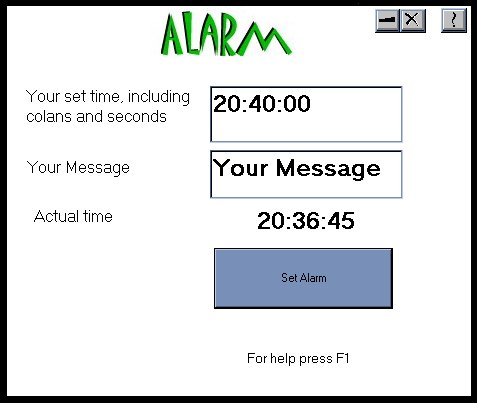



## Alarm V2\.0

### Description

This is a great program that i use all of the time, if you need to remind yourself to do something, like record tv program at a set time you can with this program, you type in the time that you want to me reminded and the message, and at the set time you will be reminded, you need your system clock to be in24 hour format
 
### More Info
 
No side effects that i know of

             |
---                |---
**Submitted On**   |2000-11-18 10:29:10
**By**             |[Dean Chapman](https://github.com/Planet-Source-Code/PSCIndex/blob/master/ByAuthor/dean-chapman.md)
**Level**          |Intermediate
**User Rating**    |4.3 (13 globes from 3 users)
**Compatibility**  |VB 5\.0, VB 6\.0
**Category**       |[Complete Applications](https://github.com/Planet-Source-Code/PSCIndex/blob/master/ByCategory/complete-applications__1-27.md)
**World**          |[Visual Basic](https://github.com/Planet-Source-Code/PSCIndex/blob/master/ByWorld/visual-basic.md)
**Archive File**   |[CODE\_UPLOAD1180811182000\.zip](https://github.com/Planet-Source-Code/dean-chapman-alarm-v2-0__1-12898/archive/master.zip)

